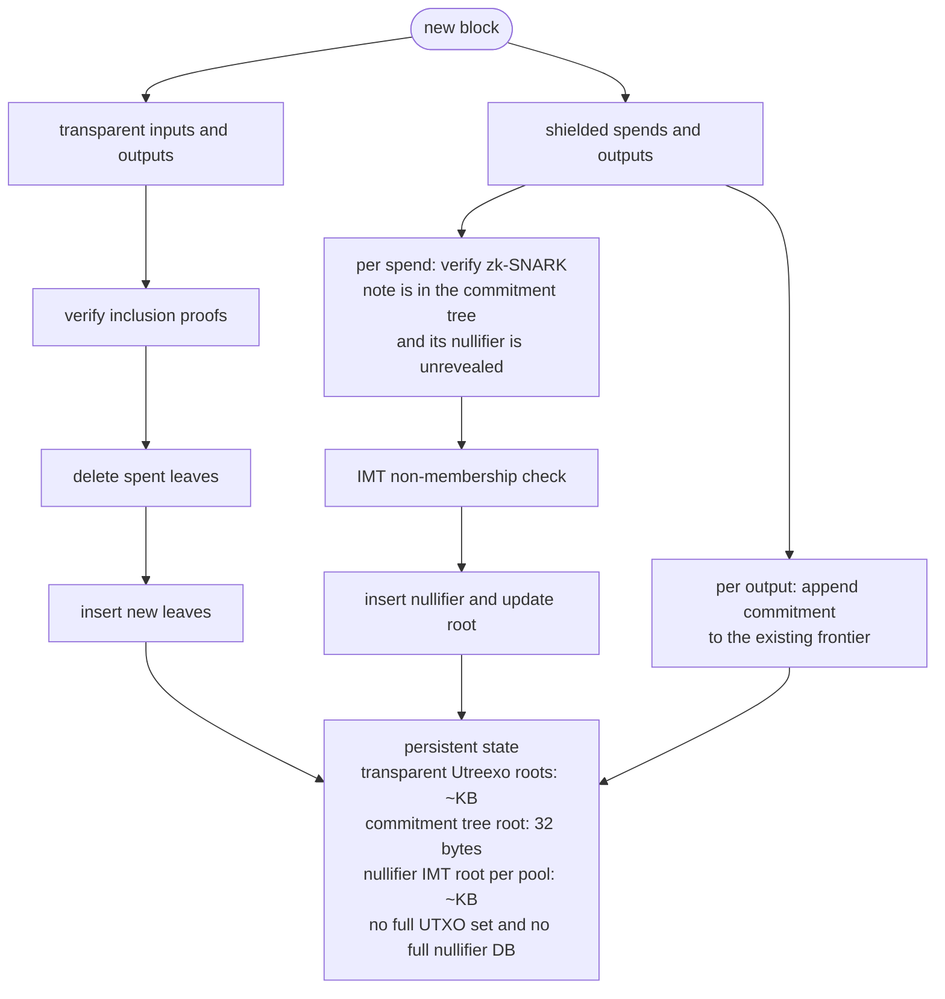

# zutreexo

Accumulator-based state compression for Zcash. Research-stage. Nothing here is production software yet.

The goal: let a Zcash validating node hold a few kilobytes of accumulator roots instead of a full transparent UTXO set and a full nullifier set — without weakening consensus, and without leaking which shielded note was spent.

## The problem

A Zcash full node keeps three growing structures in fast storage:

| Structure | What it is | Grows |
|---|---|---|
| Transparent UTXO set | Every unspent t-addr output | Insert + delete |
| Nullifier set (per pool) | "This note has been spent" tags | Insert only, forever |
| Note commitment tree (per pool) | Every shielded note ever created | Append only, forever |

Two of the three never shrink. Nothing is ever removed from the nullifier set or the commitment tree, because removal would reveal which note was spent — the exact linkage Zcash exists to prevent. So node state grows monotonically with chain history, and every shielded spend is validated against it.

Bitcoin has an answer to the analogous problem: Utreexo, Tadge Dryja's hash accumulator, which replaces the UTXO set with a forest of Merkle roots small enough to fit in a kilobyte. Nodes validate by verifying inclusion proofs attached to transaction inputs rather than by looking outputs up in a database.

This repo asks whether the same idea transfers to Zcash, and finds that it transfers to one of the three structures directly, one with a different primitive, and one not at all.

## The design, in one table

This is the load-bearing decision. The most common way to get this project wrong is to apply Utreexo uniformly.

| Structure | Operations needed | Right primitive | Why |
|---|---|---|---|
| Transparent UTXO set | insert + delete + membership | **Utreexo forest** | Identical to Bitcoin. Utreexo's forest-of-perfect-trees design exists precisely to make deletion cheap. Direct port. |
| Nullifier set | insert + **non**-membership | **Indexed Merkle Tree** | See below. |
| Note commitment tree | append + membership-in-zk | **Leave alone** | Already an append-only frontier; membership is proven inside the zk-SNARK. An accumulator adds nothing and would break the circuit. |

### Why nullifiers can't use Utreexo

A Utreexo forest — and a Merkle Mountain Range, and any unordered hash accumulator — proves membership only. Nullifier checking needs the opposite: proving a nullifier has **never** appeared. There is no way to prove absence from an unordered accumulator without holding the entire set, which defeats the purpose.

The fix is an Indexed Merkle Tree: each leaf stores `(value, next_value, next_index)`, keeping the set sorted via a linked list threaded through the leaves. Non-membership of `x` is proven by exhibiting the "low leaf" `L` where `L.value < x < L.next_value`, plus an ordinary Merkle path to `L`. Insertion touches two paths, `O(log n)`.

If someone proposes "just use Utreexo with deletion disabled" for nullifiers, that's the known failure mode. It cannot answer the question being asked.

## What this actually buys

Honest framing, because the obvious pitch is the wrong one.

**It does not make wallet sync faster.** Wallet sync is dominated by trial decryption — attempting to decrypt every shielded output with your viewing key, because that is the only way to learn a note is yours. No accumulator changes that. Projects like ZODL's Slipstream, hanh's Warp Sync, and Zingo's pepper-sync attack that cost, and they operate at a layer this project doesn't touch. They are complementary, not competitors.

What it does buy:

- **`O(log n)` spend-detection instead of a linear scan.** Today a wallet learns its notes were spent by watching every block's revealed nullifiers go by — linear in the gap since last sync. With an IMT, the wallet requests a non-membership proof per nullifier: logarithmic, and independent of chain length. For a wallet resuming after a long absence, that's an asymptotic improvement over anything currently shipping.
- **Node state decoupled from chain history.** A validating node holds roots plus a proof cache rather than full sets.

The costs, which are real and measured rather than assumed:

- **Proofs add bandwidth.** Bitcoin's Utreexo simulations saw roughly a quarter more download; Zcash's figure will differ and is a Phase 5 measurement.
- **Asking a server for a specific nullifier's non-membership proof is a metadata leak.** Mitigations — batching, decoys, restricting queries to nullifiers about to be published anyway — are an explicit review gate, not an afterthought.
- **Zcash's transparent UTXO set is far smaller than Bitcoin's**, so the transparent-side win may not justify its bandwidth. If the numbers say that, the project narrows to the nullifier accumulator and drops the transparent forest.

## Architecture



Note the per-pool parameterisation. Ironwood activated at block 3,428,143 (NU6.3) with Orchard restricted to withdrawals only, and withdrawal is discretionary — so Orchard drains slowly rather than emptying. Both nullifier sets are live indefinitely. One IMT per pool is mandatory, not defensive.

## Consensus posture

Phases 0–5 are consensus-neutral by construction. Proofs are supplied out-of-band by bridge nodes, not embedded in transactions. Nothing changes about which blocks a node accepts. This means the work can proceed, be measured, and be discarded without ever asking the network for anything.

Embedding proofs in the transaction format is a hard fork and is deliberately last, gated on whether the measurements justify it.

## Correctness approach

Differential testing against Zebra is the primary correctness signal. A green unit-test suite with a divergent root is a failure.

Two oracles, because they catch different bug classes:

1. **A naive `BTreeMap` model** — deliberately dumb, deliberately slow, sharing zero code with the accumulator so the two cannot be wrong in the same way. Catches accumulator bugs. The rule is enforced by a test that reads the oracle files as text and fails if they import what they check, because no compiler can enforce it.
2. **The validator's own answers** — catches parsing bugs, where both models agree because both were fed the same garbage.

Three comparison tiers:

| Tier | Runs | Compares |
|---|---|---|
| 1 — counts | every block | per-pool nullifier and UTXO counts against the naive model |
| 2 — cold roots | every N blocks | incremental roots against roots **recomputed from scratch** |
| 3 — validator | once per slice | our extracted totals against `zebrad`'s own JSON |

Tier 2 is the load-bearing one — it catches drift, which accumulates silently over a million-block replay and surfaces only when someone cannot spend.

All three are implemented and all four fixture slices pass. **Each tier is proven to fire by fault injection** rather than assumed to work: corruptions go into the implementation's input only, while the oracle still sees the truth, so an injected fault is indistinguishable from a real bug. Each has a paired test proving the *other* tiers are blind to it — without that pairing, a test proves only that something fired, not that the expensive tier was needed.

| Injected fault | Caught by | Provably blind |
|---|---|---|
| drop a nullifier | tier 1 | — |
| drop an output | tier 1 | — |
| reorder nullifiers within a pool | **tier 2** | tier 1 — counts are unchanged |
| undercount a note commitment | **tier 3** | tiers 1 and 2 — both read the same parse |

Plus reorg fuzzing, which is where accumulator implementations actually break. The invariant is byte-identical roots or failure — never "equivalent", never "same balance" — and **10⁶ randomised reorgs hold it**, each comparing the incrementally-maintained state against a cold replay of the chain that now exists.

Utreexo deletion turned out not to be invertible from a delta *at all*: `rustreexo` offers no way to reinsert a leaf at its former position. The nullifier trees roll back by delta, exactly; the transparent forest rolls back by snapshot and replay. See `docs/design.md` D18.

The fuzzer earned its place immediately, finding a serialisation bug that had been latent since Phase 1 — `Empty` node hashes were being read back as `Some`, which would have corrupted any snapshot of a forest that had ever seen a deletion.

## Status

| Phase | Scope | Status |
|---|---|---|
| 0 | Spike, baseline measurements, fixture capture | **complete** — measured at mainnet tip 2026-08-12, [`docs/benchmarks.md`](docs/benchmarks.md) |
| 1 | Accumulator core (Utreexo wrapper + IMT) | **complete for the IMT**; transparent side blocked, see below. One DoD item unmet: `imt.rs` branch coverage is 41/48, not the required 100% — see [`PLAN.md`](PLAN.md) |
| 2 | Chain state transition + differential harness | **complete** — four fixture slices agree with an independent oracle and with `zebrad`; 10⁶ randomised reorgs replay byte-identical to a cold replay; **all 3.45M mainnet blocks replay from genesis to tip with zero errors** |
| 3 | Persistence, snapshots, crash consistency | next |
| 4 | Bridge node (proof serving) | not started |
| 5 | Compact state node + published benchmarks | not started |
| 6 | Fuzzing, DoS analysis, privacy review | not started |
| 7 | ZIP draft — gated on 5 and 6 | not started |

The nullifier indexed Merkle tree is implemented, differentially tested against an independent oracle, pinned with checked-in vectors, and benchmarked: non-membership verification is **5.1 µs and flat** from 10⁴ to 10⁶ nullifiers at the production depth of 40, which is the asymptotic claim this project rests on. See [`docs/benchmarks.md`](docs/benchmarks.md).

**The transparent side is blocked upstream.** `rustreexo` 0.6.0 generates invalid inclusion proofs for any leaf whose sibling has been deleted — reproduced with stock upstream types, so it is not our domain separation. A bridge node cannot serve transparent proofs across blocks until it is fixed. The defect is pinned in [`crates/zutreexo-accumulator/tests/upstream_rustreexo.rs`](crates/zutreexo-accumulator/tests/upstream_rustreexo.rs), which fails loudly if upstream fixes it. Analysis and options in [`docs/design.md`](docs/design.md) D10. The nullifier IMT is unaffected — it depends on nothing but BLAKE2b.

Decisions taken so far, with reasoning, are in [`docs/design.md`](docs/design.md). The phased plan with per-phase definitions of done is in [`CLAUDE.md`](CLAUDE.md). Current status, branch naming, and the gaps being carried deliberately are in [`PLAN.md`](PLAN.md).

## Build and test

```bash
cargo test --workspace --locked     # unit, differential, vector, and property tests
cargo clippy --workspace --all-targets --locked -- -D warnings
cargo bench -p zutreexo-accumulator

# Phase 1 definition of done
PROPTEST_CASES=10000 cargo test --release -p zutreexo-accumulator --test properties

# The differential harness at its strictest: a cold root rebuild after every
# block, at a deeper tree. Needs the full fixture corpus (see below).
ZUTREEXO_HARNESS_DEPTH=14 ZUTREEXO_ROOT_CHECK_EVERY=1 \
  cargo test --release -p zutreexo-testkit --test harness_replay
```

### Fixtures

One 200-block slice (`fixtures/nu5-orchard.jsonl`, 1.85 MB) is committed, because every test touching `zutreexo-chain` is gated on a fixture being present — with all of them ignored, CI executed none of that crate. The other three slices are 63 MB and stay gitignored; regenerate them with `scripts/measure_baseline.sh` against a synced node. Tests skip, loudly, when a slice is absent.

## Open questions

Neither is resolved, and the project proceeds anyway — this is a build-to-learn exercise, and discovering that the answer makes the work redundant is a valid outcome to reach by building rather than by speculating.

- **Does Tachyon's PIR work subsume the nullifier use case?** Delivering Tachyon was described as the ecosystem's next protocol priority at the 2026 Summer ZODL Summit, and private information retrieval was a summit topic. If PIR gives wallets private nullifier queries with a better privacy story, this project's main benefit evaporates.
- **Will NU7 change block times?** The coinholder vote opening late August 2026 includes 3× faster blocks, which would triple nullifier growth rates and invalidate any capacity ceiling extrapolated from today. Ceilings here are therefore derived from transaction counts, not block counts.

## Licensing

MIT OR Apache-2.0, matching `librustzcash` and Zebra. `deny.toml` enforces the boundary — notably against AGPL dependencies, which would relicense the whole project.

## Prior art

- **[Utreexo](https://eprint.iacr.org/2019/611)** — Dryja, ePrint 2019/611. The original accumulator. [`rustreexo`](https://github.com/mit-dci/rustreexo) is the Rust implementation.
- **Indexed Merkle Trees** — the non-membership structure, as used in Aztec's nullifier tree.
- **[Zebra](https://github.com/ZcashFoundation/zebra)** — the Rust Zcash validator; our oracle.
- **[Zaino](https://github.com/zingolabs/zaino)** — the Rust indexer replacing `lightwalletd`; likely integration point for the bridge node rather than a fork of our own.
- **Slipstream, Warp Sync, pepper-sync** — wallet sync engines. Different layer; read them to understand what this project is *not* solving.

## Contributing

Too early for feature contributions. What's useful right now: review of the design decision in the table above, and answers to the two open questions. Open an issue.
